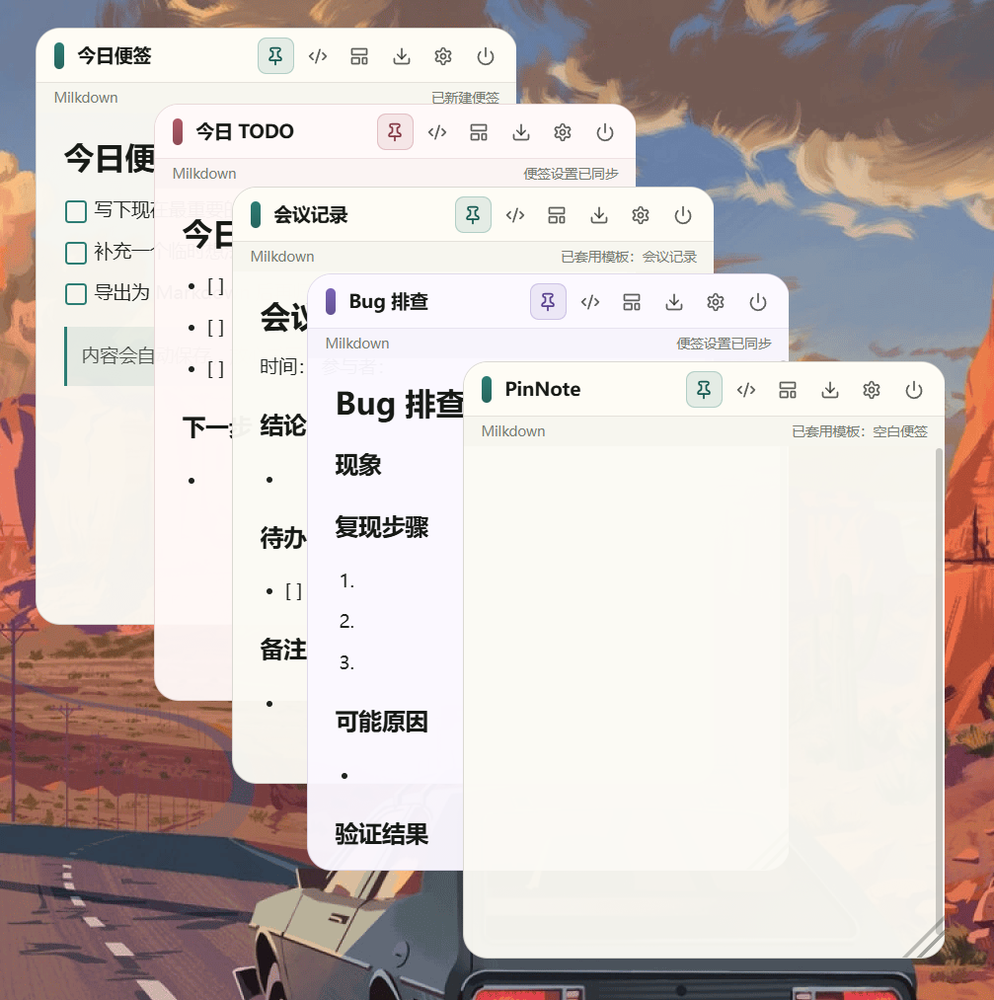

# PinNote


PinNote 是一个基于 **Tauri + SvelteKit + TypeScript** 的极简桌面 Markdown 贴屏便签。

当前版本：**v1.0.1**。

它不是完整笔记软件，也不打算替代 Obsidian、Notion 或 Typora。它的目标很克制：提供一个轻量、漂亮、可置顶、可导出 Markdown 的桌面便签窗口，让你在工作、学习、写代码或等待 AI 结果时，随手记录当前要做的事情。

## 界面预览



PinNote 的核心界面是一张可以贴在桌面上的轻量便签：标题栏负责拖拽、置顶、模板和窗口操作，正文区域用于 Markdown 记录。每张便签都可以独立调整颜色、透明度、位置和大小。

## 为什么做 PinNote？

很多时候，我们不是缺一个复杂的笔记系统，而是缺一个“贴在眼前的小提醒”。

比如：

- 等 AI 生成结果时，顺手刷了一会儿手机，回来就忘了刚才要继续做什么；
- 写代码时，一边改 bug，一边临时想到几个待办，但又不想打开 Obsidian 或 Notion；
- 开会时，只想快速记几条要点，不想进入完整笔记流程；
- 写论文或做项目时，需要把当前思路、TODO、命令、提示词贴在屏幕边上；
- 临时复制了一段 Markdown 内容，只想稍后导出保存，而不是放进复杂的笔记库。

PinNote 想解决的就是这类问题：

> 把“当前正在做什么”贴在屏幕上，减少上下文丢失。

它更像是一张桌面便利贴，而不是一个笔记管理系统。

## 产品定位

PinNote 只做一件事：

> 一个可以贴在屏幕上的 Markdown 临时便签。

它适合这些场景：

- 写代码时放今日 TODO；
- 等待 AI、编译、训练、下载结果时记录下一步动作；
- 开会时记录临时要点；
- 写论文时贴一段思路；
- 做项目时放当前计划；
- 临时记录 Markdown 片段；
- 把当前任务清单放在屏幕角落，避免被浏览器、聊天软件或手机打断。

默认情况下，PinNote 更强调“临时记录”和“快速导出”，而不是长期管理。重要内容建议手动导出为 `.md` 文件，沉淀到你自己的笔记系统中。

## 功能特性

当前版本已经支持：

- 极简无边框桌面窗口；
- 自定义标题栏；
- 标题栏拖拽移动窗口（小手光标）；
- 右下角拖拽调整窗口大小；
- 窗口置顶开关；
- Milkdown 所见即所得 Markdown 编辑器（GFM 语法）；
- Markdown 源码模式切换；
- 任务列表 `- [ ]` 支持点击勾选；
- 表格基础样式优化（边框、表头、斑马纹和横向滚动）；
- 模板面板：支持内置模板和最多 8 个自定义模板；
- 模板可一键替换当前便签标题和内容；
- Markdown 导出为 `.md` 文件；
- 导出时可选择保存位置；
- 便签内容自动保存（关闭重开不丢失）；
- 背景主题切换（6 预设 + 自定义色）；
- 透明度调节；
- 开机自启设置；
- 开机自启后支持隐藏启动；
- 系统托盘（显示最近便签、新建便签、设置、退出）；
- 关闭窗口默认隐藏到托盘；
- 全局快捷键（Windows 默认 Alt+N / Alt+Shift+N；macOS 默认 CmdOrCtrl+Option+N / CmdOrCtrl+Option+Shift+N）；
- 应用内快捷键（Ctrl+S/T/,// 等）；
- 独立设置窗口（外观/行为/快捷键三标签页）；
- 全局快捷键自定义配置；
- 窗口位置和大小记忆；
- 多便签独立窗口；
- 每张便签独立保存内容、颜色、透明度、置顶状态、位置和大小；
- `Ctrl+S` 只导出当前聚焦的便签；
- 当前编辑模式内支持撤销/重做；
- Markdown 源码模式基础编辑增强（Tab 缩进、加粗/斜体、列表延续）；
- 基于 Tauri 的跨平台桌面应用基础。

---

## 多便签模型

PinNote 的多便签不是同一个窗口里的标签页，而是多张独立的桌面便签窗口。

每张便签都有自己的内容、标题、背景色、透明度、置顶状态、窗口位置和窗口大小。你可以把不同便签分别贴在桌面的不同位置，用来承载不同的当前上下文，例如今日 TODO、会议要点、当前命令、AI 提示词或临时 Markdown 草稿。

关闭某张便签时，它会隐藏并保存自己的状态；托盘里的“显示最近便签”会恢复最近活跃或最近关闭的便签；“新建便签”会打开一张新的独立便签。`Ctrl+S` 只作用于当前聚焦的便签，不会导出其他窗口的内容。

便签数据保存在应用数据目录的 `notes.json` 中。旧版单便签数据会从 `note.json` 自动迁移到新的多便签数据结构。

---

## Markdown 与编辑边界

PinNote 当前以轻量 Markdown 记录为主，重点支持标题、段落、列表、任务列表、引用、代码、链接和表格等常见语法。表格已经做了基础显示优化，适合放简单计划、对比项和临时整理内容。

图片不是 v1.0.0 的核心能力。截图粘贴在部分情况下可以显示，因为截图工具通常会把图片像素数据直接放进剪贴板，编辑器可以将其作为内嵌图片处理；但从资源管理器或 Finder 复制本机图片文件时，剪贴板里通常是文件引用而不是图片本体，当前 PinNote 不会读取本地文件并导入图片。通过 Markdown 图片语法引用本地文件，例如 `` 或 ``，也不承诺稳定支持。

PinNote 暂时不会放开任意系统文件访问，也不会在 v1.0.0 做完整图片资源管理。已粘贴显示的图片目前也不提供拖拽移动、拖拽缩放或图片尺寸面板；这符合 PinNote 作为轻量便签的定位。后续如果正式支持图片，更合理的方向是把图片复制到应用数据目录，再由 PinNote 用受控路径引用。

撤销/重做作用于当前编辑模式。所见即所得模式和 Markdown 源码模式使用不同的编辑器历史，因此切换模式后不会共享同一条撤销栈；在当前模式继续编辑后，撤销/重做会继续正常工作。

---
## 更新日志

### v1.0.1 (2026-05-25) — 启动项与发布修正

- 明确 Windows/macOS 开机自启注册名称为 `PinNote`
- 开机自启继续使用隐藏启动参数 `--hidden`
- 修正启动项状态和设置显示可能不一致的问题

### v1.0.0 (2026-05-24) — 正式初版

- 新增工具栏模板按钮，当前便签内可直接打开模板面板
- 新建便签保持空白，不强制进入模板选择流程
- 支持内置模板：空白便签、今日 TODO、会议记录、AI 提示词、项目计划、Bug 排查
- 支持新增和删除自定义模板
- 自定义模板最多保存 8 个，数据保存到应用数据目录的 `templates.json`
- 套用模板会替换当前便签标题和内容；当前内容非空时会先确认

### v0.4.0 (2026-05-21) — 可靠保存 + 托盘常驻

- 便签内容改为原子保存，并在导出、退出、隐藏前强制落盘
- 设置迁移到应用数据目录保存，便于后续备份和迁移
- 支持多便签独立窗口，每张便签可独立置顶、改颜色、调透明度和记忆位置
- 多窗口保存改为按便签合并，避免多个便签同时保存时互相覆盖
- 旧版单便签数据自动迁移到多便签数据结构
- `Ctrl+S` 只导出当前聚焦窗口的便签
- 支持开机自启后隐藏启动
- 增加轻量系统托盘：显示最近便签、新建便签、设置、退出
- 关闭窗口默认隐藏到托盘，工具栏电源按钮关闭当前便签
- 记住每张便签窗口的位置和大小
- 全局快捷键注册失败时给出状态提示
- 优化 Markdown 表格显示样式
- 明确图片能力边界：暂不承诺本地图片路径和完整图片资源管理
- 撤销/重做限定为当前编辑模式内的历史
- Markdown 源码模式支持 Tab 缩进、加粗/斜体包裹、列表/任务项回车延续
- 修复新建便签后 Milkdown 编辑器可能继续显示旧内容的问题

### v0.3.0 (2026-05-20) — 快捷键 + 设置窗口

- 全局快捷键：Windows 默认 `Alt+N` 显示最近便签、`Alt+Shift+N` 新建便签；macOS 默认 `CmdOrCtrl+Option+N` 显示最近便签、`CmdOrCtrl+Option+Shift+N` 新建便签
- 应用内快捷键：`Ctrl+S` 导出、`Ctrl+T` 置顶、`Ctrl+/` 切换源码模式、`Ctrl+,` 打开设置
- Milkdown 内置 `Ctrl+B` 加粗、`Ctrl+I` 斜体
- 设置面板重构为独立窗口，分三个标签页：外观 / 行为 / 快捷键
- 全局快捷键支持自定义录入和重置
- 设置窗口与主窗口实时同步

### v0.2.0 (2026-05-20) — 自动保存 + 编辑器修复

- 便签内容自动保存到应用数据目录（关闭重开不丢失）
- 修复 Milkdown 所见即所得编辑器无法渲染的问题（pnpm 依赖提升 + commonmark preset 缺失）
- 任务列表 `- [ ]` 支持 CSS 复选框渲染和点击切换
- 拖拽区域显示小手光标（移除 `data-tauri-drag-region` 对 cursor 的干扰）
- 依赖整合为 `@milkdown/kit`，清理无用包

### v0.1.0 — 初版

- 极简无边框桌面窗口、自定义标题栏
- Milkdown Markdown 所见即所得编辑 + 源码模式切换
- Markdown 导出为 `.md` 文件
- 背景主题切换（6 预设 + 自定义色）、透明度调节
- 窗口置顶、开机自启、右下角缩放

---

## 当前设计原则

PinNote 的第一版遵循这些原则：

- 支持少量独立桌面便签；
- 不做完整笔记管理；
- 不做同一窗口内的标签页式笔记管理；
- 不做账号和云同步；
- 不做复杂知识库；
- 不强迫用户进入完整编辑器页面；
- 优先保证轻量、好看、随手可用；
- 重要内容通过 Markdown 导出沉淀；
- 尽量减少对用户工作流的打扰。

换句话说，PinNote 不是用来“管理所有知识”的，而是用来“保住当前上下文”的。

## 技术栈

- [Tauri 2](https://tauri.app/)
- [SvelteKit](https://svelte.dev/) + Svelte 5
- TypeScript + Rust
- Milkdown（@milkdown/kit）
- lucide-svelte
- Tauri 插件：Dialog、Autostart、Global Shortcut

## 项目结构

```txt
src/
  components/       Svelte 组件
  lib/              前端工具函数和设置逻辑
  routes/           SvelteKit 页面入口

src-tauri/
  src/              Rust 命令和 Tauri 启动逻辑
  capabilities/     Tauri 权限配置
  tauri.conf.json   桌面窗口和打包配置

```

## 开发运行

安装依赖：

```
pnpm install
```

启动桌面开发环境：

```
pnpm tauri dev
```

类型检查：

```
pnpm check
```

构建前端：

```
pnpm build
```

打包桌面应用：

```
pnpm tauri build
```

## 打包说明

Tauri 支持同一套代码跨平台开发，但安装包通常需要在对应系统上分别构建。

- 在 Windows 上构建 Windows 安装包或 `.exe`；
- 在 macOS 上构建 `.app` 或 `.dmg`；
- Windows 的 `.exe` 不能直接在 macOS 上运行；
- macOS 打包、签名和公证需要额外配置。

后续可以通过 GitHub Actions 在 Windows 和 macOS 环境中自动打包发布。

## Roadmap

### 已完成

-  Tauri + SvelteKit 项目基础结构；
-  无边框桌面窗口；
-  自定义标题栏；
-  窗口拖拽移动；
-  右下角拖拽缩放；
-  Milkdown 所见即所得 Markdown 编辑；
-  Markdown 源码模式切换；
-  Markdown 导出；
-  自定义背景色 + 透明度调节；
-  开机自启设置；
-  便签内容自动保存；
-  全局快捷键（显示最近便签、新建便签）；
-  应用内快捷键（导出、置顶、切换模式、打开设置）；
-  独立设置窗口（外观/行为/快捷键）；
-  全局快捷键自定义配置；
-  便签原子保存和退出/隐藏前强制保存；
-  设置保存到应用数据目录；
-  开机自启隐藏启动；
-  轻量系统托盘；
-  关闭窗口隐藏到托盘；
-  窗口位置和大小记忆；
-  多便签独立窗口；
-  多便签按便签合并保存，避免跨窗口覆盖；
-  Markdown 模板面板；
-  内置模板 + 最多 8 个自定义模板；
-  表格基础显示样式优化；
-  当前编辑模式内撤销/重做；
-  源码模式基础编辑增强。

### 近期计划

-  支持 Windows 正式打包发布；
-  支持 macOS 打包测试。

### 后续可能加入

-  导出目录记忆；
-  GitHub Actions 自动构建 Windows / macOS 安装包；
-  未来可能探索 Slint 原生轻量版本。

### 暂不计划

-  账号系统；
-  云同步；
-  团队协作；
-  完整知识库管理；
-  双链笔记；
-  插件系统；
-  富媒体文件管理。

## 版本状态

当前版本为 **v1.0.1**，核心体验已经闭环：多便签独立窗口、自动保存、系统托盘、全局快捷键、设置窗口、Markdown 编辑、导出和模板能力都已具备。

它更适合作为：

- 临时 TODO 便签；
- Markdown 草稿纸；
- AI 等待期间的任务提醒；
- 项目当前计划板；
- 桌面上的轻量 Markdown 便利贴。

如果你需要长期、复杂、结构化的知识管理，建议继续使用 Obsidian、Notion、Logseq 等成熟工具。PinNote 更适合承担“临时记录”和“当前上下文提醒”的角色。

## 使用建议

多便签适合同时贴几张当前上下文：一张放今日 TODO，一张放当前命令，一张放会议临时要点。建议保持少量窗口；重要内容仍然及时导出归档。

PinNote 更适合记录短内容，例如：

```
# 当前任务

- [ ] 等 AI 返回后继续修改 README
- [ ] 检查 pnpm tauri build 是否成功
- [ ] 上传 release 包
- [ ] 补充 GitHub Actions
```

或者：

```
# 今日计划

1. 修复窗口样式
2. 优化 Markdown 编辑体验
3. 发布 v1.0.0
```

如果内容变得很重要，建议及时导出为 `.md` 文件，放入自己的正式笔记库中。

## License

MIT
