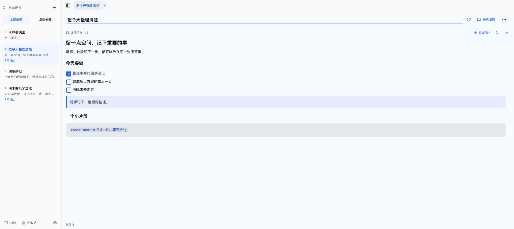
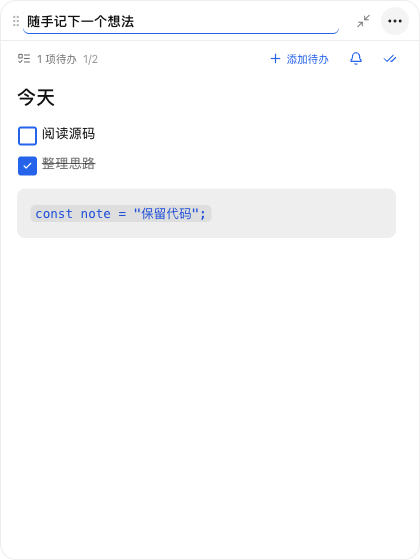

# PinNote

轻量桌面 Markdown 便签。随手写下，收在屏幕边缘，需要时再展开。

**便签中心负责查找和整理，独立便签负责随手编辑，边缘胶囊负责随时查看。三种形态共享同一张便签。**

当前版本 **1.2.0** · [下载安装包](https://github.com/Zhong0118/PinNote/releases/latest) · [1.2.0 更新说明](https://github.com/Zhong0118/PinNote/releases/tag/v1.2.0)

## 界面

便签中心：搜索、工作 Tab、背景颜色与正文待办。



轻量提醒：快捷时间和自定义日期、时间。


独立便签与收起后的胶囊：




以上截图来自实际 Svelte / Milkdown 界面，使用示例内容与模拟系统接口，不含个人便签；截图不代表原生多屏或通知验收。

## 1.2 带来了什么

- **便签中心**：搜索标题和正文，筛选全部／桌面便签；工作 Tab 可切换、关闭、拖动重排，过多时使用溢出入口。关闭 Tab 不删除便签。
- **桌面与中心切换**：放到桌面、定位窗口、收回中心共用同一 ID。独立窗口编辑时中心呈现只读的所见即所得预览，定位会展开并高亮。
- **贴边胶囊**：拖动标题栏握柄或胶囊，靠近左右工作区边缘后松手收纳；也可从更多菜单选择收纳到左侧／右侧。队列自动排列，支持上下排序、向内拖出和溢出入口。悬停延迟出现只读预览，编辑中仅手动收起。
- **整理与恢复**：归档、回收站、恢复和移除撤销。恢复先回中心；永久删除仅在回收站确认后执行。
- **正文待办**：直接添加待办、查看未完成数量和进度，完成项清理可撤销；文字、代码与清单自然混排。
- **一次性提醒**：每张便签一个提醒时间，应用后台调度，到点系统通知，中心提供打开和延后入口。
- **本地 MCP**：agent 可搜索、读写、整理便签和设置提醒，版本检查与可恢复历史保护已有内容。
- **直接换色**：工作台标题旁的调色盘支持主题色与自定义颜色，同步到桌面便签；换色不覆盖正文草稿。

## 日常使用

点击“新建便签”开始书写。正文支持 Markdown 标题、列表、任务项、引用、代码和表格，输入后自动保存。更多菜单提供模板、源码、导出、提醒、归档等操作。

独立便签标题栏保持紧凑。收起后变为 `180 × 40` 胶囊；点击胶囊或按 Enter / 空格展开。展开尺寸和自由位置分别保存，收起期间保留编辑器。拖动窗口边缘或四角调整大小，最小 `260 × 180`。

中心和桌面同一时间只有一个主要编辑位置。切换前先保存；中心 Tab 在会话内记住选区与滚动，跨编辑位置重新开始撤销历史。关闭中心仅隐藏窗口，不退出应用。托盘菜单提供中心入口、显隐、新建、设置、更新与退出。

**全局显隐只处理已放到桌面的普通便签**，不会打开整个便签库、归档或回收站。独立便签菜单可导出 `.md`。

### 待办和提醒

点击编辑区的“添加待办”，输入内容后按 Enter；也可以直接输入 `- [ ]`。点击复选区或在任务项内按 Cmd/Ctrl+Shift+Enter 切换完成状态。移除已完成项是一个可用 Cmd/Ctrl+Z 撤销的事务。代码围栏中的清单示例不计入进度。

通过更多菜单或待办旁的铃铛设置提醒。设置后出现时间标签，再次点击可修改或移除。Rust 后台每 15 秒检查到期时间，不依赖某个编辑窗口。

- 在托盘运行时提醒有效；完全退出时不会通知，下次启动处理错过的提醒。
- 归档暂停提醒，恢复清除旧安排，删除取消提醒。
- 到期操作入口在便签中心：打开便签、延后 10 分钟、清除提醒。系统通知本身不含跨平台操作按钮。
- 为避免重复通知，先持久化处理状态再调用系统；权限、勿扰模式或该间隙崩溃可能导致通知未展示，不保证必达。

### 快捷键

| 操作 | macOS | Windows |
| --- | --- | --- |
| 显示／隐藏桌面便签 | Cmd + Option + N | Alt + N |
| 新建便签 | Cmd + Option + Shift + N | Alt + Shift + N |
| 导出独立便签 | Cmd + S | Ctrl + S |
| 切换置顶 | Cmd + T | Ctrl + T |
| 切换源码 | Cmd + / | Ctrl + / |
| 打开设置 | Cmd + , | Ctrl + , |
| 加粗／斜体 | Cmd + B / I | Ctrl + B / I |
| 切换当前任务完成状态 | Cmd + Shift + Enter | Ctrl + Shift + Enter |

前两项为全局快捷键，可在设置中修改。其余在对应编辑窗口生效。源码与可视编辑不共享撤销栈，收起胶囊不切换编辑模式。

## 安装与更新

从 [GitHub Releases](https://github.com/Zhong0118/PinNote/releases/latest) 下载：

- **macOS**：通用 `.dmg` 支持 Apple Silicon / Intel，将 PinNote 拖入应用程序目录。使用 ad-hoc 签名，未做 Developer ID 签名与 Apple 公证。
- **Windows x64**：选择 `.exe`（NSIS）或 `.msi` 安装，需要 WebView2。

托盘菜单“检查更新”可下载、验签、保存便签后安装重启。自动检查间隔为 24 小时，手动检查有 30 秒冷却，同一版本不会重复自动提醒；记录跨重启保留。保存失败、超时或签名校验失败会取消更新。

1.1.2 及更早版本需先手动安装新版。更新从 GitHub Release 的 `latest.json` 和签名附件获取，需要能够访问 GitHub。更新签名不等同于 Apple 公证或 Windows 代码签名。

## 本地 MCP

安装 **Node.js 22+**，保持 **PinNote 1.2.0 或更新版本运行**，并从本仓库取得 [scripts/pinnote-mcp.mjs](scripts/pinnote-mcp.mjs)。脚本无额外 Node 依赖，也可单独下载后保存。

在“设置 → 集成”启用本地 MCP。默认关闭；启用后默认只读、仅普通便签，可自行开启写入和全部范围。设置中可查看最近连接、agent 修改记录和撤销入口。

MCP 客户端配置示例，替换为脚本的绝对路径：

```json
{
  "mcpServers": {
    "pinnote": {
      "command": "node",
      "args": ["/absolute/path/PinNote/scripts/pinnote-mcp.mjs"]
    }
  }
}
```

Windows 路径可写作 `C:/Users/you/PinNote/scripts/pinnote-mcp.mjs`。脚本自动查找应用数据目录中的 `com.pinnote.app/mcp-connection.json`；也可以把设置页的连接文件完整路径作为第二个参数，或设置 `PINNOTE_CONNECTION_FILE`。

支持 stdio MCP `2024-11-05`。桥接仅绑定 `127.0.0.1` 随机端口，每次启动换令牌，macOS 连接文件权限 `0600`。外部脚本只读连接描述，所有便签操作经过应用服务，不直接改写数据文件；应用未运行或集成关闭会返回明确错误。

工具包括 `search_notes`、`read_note`、`create_note`、`append_note`、`update_note`、`archive_note`、`trash_note`、`restore_note`、`set_reminder`、`cancel_reminder`、`open_note`。

修改前读取 `revision`，写入时带 `expectedRevision`。发生 `VERSION_CONFLICT` 时重新读取；`EDITOR_BUSY` 表示有未保存草稿，应等待保存。提醒 `at` 为未来的 Unix 毫秒时间戳。新建默认留在中心，只有明确调用 `open_note` 才请求桌面显示；其返回值表示请求已提交，不代表窗口显示确认。

agent 修改前版本与 UI 移除历史合计保留最近 100 次可恢复操作。设置中撤销后便签回到中心；永久删除会清除该便签恢复历史。

## 数据与兼容

应用标识仍为 `com.pinnote.app`。通过“设置 → 行为 → 用户数据”打开目录。

| 文件 | 内容 |
| --- | --- |
| `notes.json` | 正文、生命周期、版本、外观、窗口、提醒及恢复历史 |
| `notes.before-v2.json` | 1.2 数据升级前备份（已有不同备份时另存唯一文件名） |
| `settings.json` / `templates.json` | 全局设置／自定义模板 |
| `integration.json` / `mcp-connection.json` | MCP 权限／当前连接描述 |
| `update-history.json` | 更新检查与通知去重记录 |

旧版多便签数据迁移前先备份并同步到磁盘，保留原 ID、正文、外观和位置；更早的 `note.json` 原文件继续保留。新格式将内容生命周期、桌面位置和内容版本分开管理。损坏文件不当作空库覆盖，保存失败保留草稿，退出前等待所有编辑器保存。

备份时从托盘退出，再复制整个数据目录。**不要同时运行两个使用同一数据目录的 PinNote 实例。** 降级前先备份当前目录，旧版本不理解 1.2 生命周期与恢复历史。

## 开发与检查

Tauri 2、Rust、Svelte 5 / SvelteKit、TypeScript、Milkdown、Lucide。前端未引入额外 UI 框架。

准备 Node.js 22+、pnpm 9、Rust stable 和 [Tauri 平台前置环境](https://v2.tauri.app/start/prerequisites/)：

```sh
pnpm install --frozen-lockfile
pnpm tauri dev
```

```sh
pnpm check
pnpm test
pnpm tauri build --no-bundle --ci -- --locked
cargo test --manifest-path src-tauri/Cargo.toml --locked
cargo clippy --manifest-path src-tauri/Cargo.toml --locked --all-targets -- -D warnings
```

本地打包、不生成更新签名：

```sh
pnpm tauri build --config '{"bundle":{"createUpdaterArtifacts":false}}' -- --locked
```

产物位于 `src-tauri/target/release/bundle/`。推送 `v*` 标签触发双平台发布：先生成草稿、安装包、签名与 `latest.json`，完整校验 Mac 双架构和 Windows NSIS/MSI 更新目标后才公开。Actions 使用仓库已有的 `TAURI_SIGNING_PRIVATE_KEY`；不要更换现有密钥，否则旧客户端无法验签。

## 验证范围

1.2.0 本地通过：69 项 Node 测试、22 项 Rust 单元测试和 1 项更新器集成测试、Svelte 类型检查、clippy、macOS release 构建。浏览器回归覆盖工作台预览、颜色、待办、提醒、保存失败与窗口操作路径。隔离原生应用的 MCP 实际连接验证了备份迁移、读写权限、冲突、恢复与后台提醒处理。

原生 Windows 桌面交互、混合 DPI 多屏拖动和热拔插、中文输入法连续组词、预览焦点连续性及系统通知实际展示仍需实机验收。自动化几何测试和模拟 IPC 不替代这些检查。

详细记录见 [DEVELOPMENT.md](DEVELOPMENT.md)。浏览器脚本位于 `scripts/verify-*-browser.mjs`；实际 MCP 验收使用 `scripts/verify-mcp-live.mjs`，仅对隔离测试目录运行。调试构建支持 `PINNOTE_TEST_DATA_DIR`，正式构建忽略它。

## License

MIT
